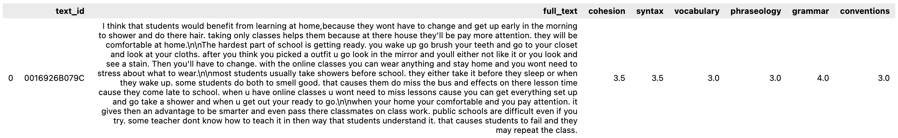

# Automated Essay Evaluator

**Authors:** Shamil Arslanov, Maxim Faleev, Danis Alukaev  
**Group:** B19-DS-01, Innopolis University

## 📝 Motivation

How important it is to write well? In our opinion, it is an essential skill that must be developed throughout your entire life. Good writing helps you in your career, relationships, personal effectiveness, and even in self-understanding.

While practicing writing skills, students generally ask their English teachers to assess texts. But what do people who do not have such an opportunity do? We believe we can help.

## ⚡ What will we implement?

Our goal is to create an open-source API for text quality evaluation. For our project, we will extensively use quality ensuring approaches and basic MLOps techniques.

As a team, we take part in the Kaggle competition which requires flexibility in terms of methods used to approach the problem. Most likely we will start with simple feature extraction via Natural Language Toolkit (NLTK) with gradient boosting and end up with state-of-the-art algorithms based on Transformers (e.g. DeBERTa).

## 🐳 Data

We will use the ELLIPSE corpus provided by Vanderbilt University and The Learning Agency Lab as a part of *[Feedback Prize - English Language Learning](https://www.kaggle.com/competitions/feedback-prize-english-language-learning)* competition*.* This dataset comprises `3911` argumentative essays each evaluated according to six measures: cohesion, syntax, vocabulary, phraseology, grammar, and conventions (see the fugure). These are numbers from `1.0` to `5.0` and step size of `0.5` with larger values corresponding to better proficiency in this aspect.

## 👤 Target audience

Our solution will help teachers speed up the review of students' essays. Also, it will help foreigners to identify gaps in learning English, e.g. if identifies that the essay has poor grammar, then the student needs to be given more exercise in the field, and the same with vocabulary, syntax, etc. 

## ✏️ What is expected from the resulting model

Our model will score students’ essays using multiple criteria: cohesion, syntax, vocabulary, phraseology, grammar, and conventions. For each criterion, the model will assign a score from `1.0` to `5.0`. The model will behave as an unbiased teacher that checks students’ work and give the grade for each aspect of language knowledge. Objective grading of a student’s essay could identify the sphere of learning English in which the student is struggling the most, indicating the need for a personal study plan change.