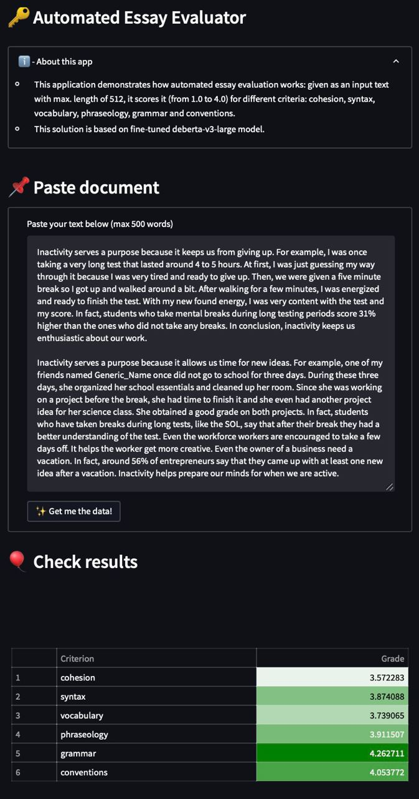

<div align="center" height="130px">
  <br/>
  <p></p>
</div>

> Express your thoughts — achieve your goals!

[](https://www.codacy.com/gh/Vitsyn-Morgunov-and-Nikulin/automatic-essay-evaluator/dashboard?utm_source=github.com&amp;utm_medium=referral&amp;utm_content=Vitsyn-Morgunov-and-Nikulin/automatic-essay-evaluator&amp;utm_campaign=Badge_Grade)
[](https://codecov.io/gh/Vitsyn-Morgunov-and-Nikulin/automatic-essay-evaluator)
[](https://github.com/Vitsyn-Morgunov-and-Nikulin/automatic-essay-evaluator/actions/workflows/ci.yaml)
[](https://github.com/Vitsyn-Morgunov-and-Nikulin/automatic-essay-evaluator/actions/workflows/kaggle.yaml)

| [🔥 Try Now!](https://huggingface.co/spaces/Booguy/automatic-essay-evaluator) | [💿 Docs](http://vitsyn-morgunov-and-nikulin.github.io/automatic-essay-evaluator) | [🏆 Competition](https://www.kaggle.com/competitions/feedback-prize-english-language-learning) | [🏋️‍♀️ Weights](https://www.kaggle.com/datasets/alukaevdanis/weights-linguask) | [📈 Monitor](https://wandb.ai/parmezano/automated_essay_evaluator/overview) |

<details>
  <summary>  📌 Table of Contents </summary>
  <ul>
    <li><a href="#about-the-project">About the project</a></li>
    <li><a href="getting-started">Getting Started</li>
    <ul>
      <li><a href="use-our-service">Use our service</li>
      <li><a href="prerequisites">Prerequisites</li>
      <li><a href="run-locally">Run application locally</li>
      <li><a href="experiments">Run experiments</li>
    </ul>
    <li><a href="#how-it-works">How it works?</a></li>
    <li><a href="#quality-ensuring">Quality Ensuring</a></li>
    <li><a href="#how-to-contribute">How to contribute?</a></li>
    <li><a href="#contributors">Contributors</a></li>
    <li><a href="#license">License</a></li>
  </ul>
</details>

<br>

## 📝 About the project <a name="about-the-project"></a>

Writing skills are essential for a modern person and must be developed throughout the entire life. Good piece of writing might help in career, relationships, personal effectiveness, and even in self-understanding. However, improving this competency could be problematic in the absence of a reviewer.

Accordingly, creation of an open-source automated text evaluator tends to be a natural step towards enhanced writing skills within society. Firstly, it can speed up the essay review processes done by teachers. Secondly, such a tool can make assessment more unbiased. Thirdly, it might help foreigners to identify linguistic gaps and thereby facilitate the learning process.

As a part of [feedback prize](https://www.kaggle.com/competitions/feedback-prize-english-language-learning) competition our goal is to create an automatic solution that scores students’ essays using multiple criteria: cohesion, syntax, vocabulary, phraseology, grammar, and conventions. For each criterion, the system assigns a score from `1.0` to `5.0`.

## ⚡ Getting Started <a name="getting-started"></a>

### Use our service <a name="use-our-service"></a>
Check out our relevant version that is [available on this link](https://huggingface.co/spaces/Booguy/automatic-essay-evaluator)!

### Prerequisites: <a name="prerequisites"></a>
1. GNU `make` utility ([link](https://www.gnu.org/software/make/))
2. Python of version 3.7.13 ([link](https://www.python.org/downloads/release/python-3713/))
3. Packaging manager `poetry` ([link](https://python-poetry.org))
4. At least 2Gb on your hard disk

Once all of above is satisfied, execute the following to setup the poetry:
```
poetry lock
poetry --no-root install
```

### Run application locally <a name="run-locally"></a>
To your delight, it's done via a single command:
```
poetry run make build
```

### Run experiments <a name="experiments"></a>
Our MLOps pipeline is powered by [Hydra package](https://hydra.cc), which allows to configure experiments via yaml files. [This directory](src/config/conf) contains nested configuration for our experiments.

Try out running a baseline using following command:
```
poetry run python -m src.main +experiment=sanity_constant_predictor
```

Directory `src/config/conf/experiments` contains our basic set-ups used in competition. We highly encourage you to fine-tune these configurations and create your own to achieve even higher results!

## 📖 How it works? <a name="how-it-works"></a>
Our top performing solution is based on the fine-tuned DeBERTa model `deberta-v3-large` and six CatBoost Regressors predicting analytical measures. Based on this solution there was built a automatic essay evaluator system powered by Hugging Face Demo engine.



The interface is quite intuitive and user-friendly: entire workflow is guided by a textual annotations. User is asked to insert an essay in a correspondent text field. Once the document is ready, our system inferences the model and visualises the results in the very same window. Essay seems to belong to a solid B student — good for him!

## 🚀 Quality Ensuring <a name="quality-ensuring"></a>
We put a significant effort to (partially) automate routine operations and restrict programmers from violating style rules and designing non-working code:
- [Using Poetry](.pyproject.toml) to avoid dependency hell (replacement for `pip` package);
- [Continuous integration workflow](.github/workflows/ci.yaml) that performs linting according to [PEP8](.flake8) and [unit/integration testing](tests);
- [Pre-commit hooking](.pre-commit-config.yaml) that runs autopep8, dependencies sorting, and autoflake;
- [Submission workflow](.github/workflows/kaggle.yaml) that loads our best performing solution to Kaggle kernel;
- [Configurable experiments](src/config/conf/) via Hydra that keeps our studies clean and structured;
- [Syncing experiments](src/model_finetuning/train.py) in [Weights & Biases](https://wandb.ai/site) that helps us to monitor progress of our experiments;
- [Automate building of project](Makefile) via Makefile;
- [Evaluation via cross-validation](src/cross_validate.py) that is cosidered to be the most objective amid possible ways to assess generalization of a model;
- [Reproducible experimentation](src/utils.py) that guarantees that same set-up will give equal results on different machines;
- [Notifications in Telegram](src/utils.py) when training is completed;
- Badges with codecov, codacy, continuous integration, and kaggle submission;
- Used [snyk](https://snyk.io) to find vulnerabilities, e.g., in this [PR](https://github.com/Vitsyn-Morgunov-and-Nikulin/automatic-essay-evaluator/pull/21);
- Used `sphinx` package for auto-generation of our [documentation](http://vitsyn-morgunov-and-nikulin.github.io/automatic-essay-evaluator);
- Tried to attach commits to tickets (mostly in latter part of development).

## ✏️ How to contribute? <a name="how-to-contribute"></a>
In our development process we followed practices described by Uncle Bob in his magnificent "Clean Code". Please, consult this book in case any trouble.

Make a fork of this repository, and develop your own tool. Make sure it is error-free and the test coverage is at least 60 percent. Update `config` files accordingly, and check their operability.

While producing your code, use this famous [git workflow](https://nvie.com/posts/a-successful-git-branching-model/). Also note that our branches use prefixes `feature/`, `fix/`, and `ci-cd/`.

Further, send a pull request. In the comment, write the main features of the tool, the technology stack used, and a brief description of the algorithms. This should be enough for us to accept your code.

> To check the quality of the code, we use `flake8` and `codacy`.

## 💻 Contributors <a name="contributors"></a>
**Shamil Arslanov** <br>
&nbsp;&nbsp;&nbsp;&nbsp;&nbsp; Email: <a>s.arslanov@innopolis.university</a> <br>
&nbsp;&nbsp;&nbsp;&nbsp;&nbsp; GitHub: <a href="https://github.com/homomorfism">@homomorfism</a> <br>

**Maxim Faleev** <br>
&nbsp;&nbsp;&nbsp;&nbsp;&nbsp; Email: <a>m.faleev@innopolis.university</a> <br>
&nbsp;&nbsp;&nbsp;&nbsp;&nbsp; GitHub: <a href="https://github.com/implausibleDeniability">@implausibleDeniability</a> <br>

**Danis Alukaev** <br>
&nbsp;&nbsp;&nbsp;&nbsp;&nbsp; Email: <a>d.alukaev@innopolis.university</a> <br>
&nbsp;&nbsp;&nbsp;&nbsp;&nbsp; GitHub: <a href="https://github.com/DanisAlukaev">@DanisAlukaev</a> <br>

## 📃 Licence <a name="license"></a>
`Lunguask` is a free and open-source software licensed under the [MIT License](LICENSE).
